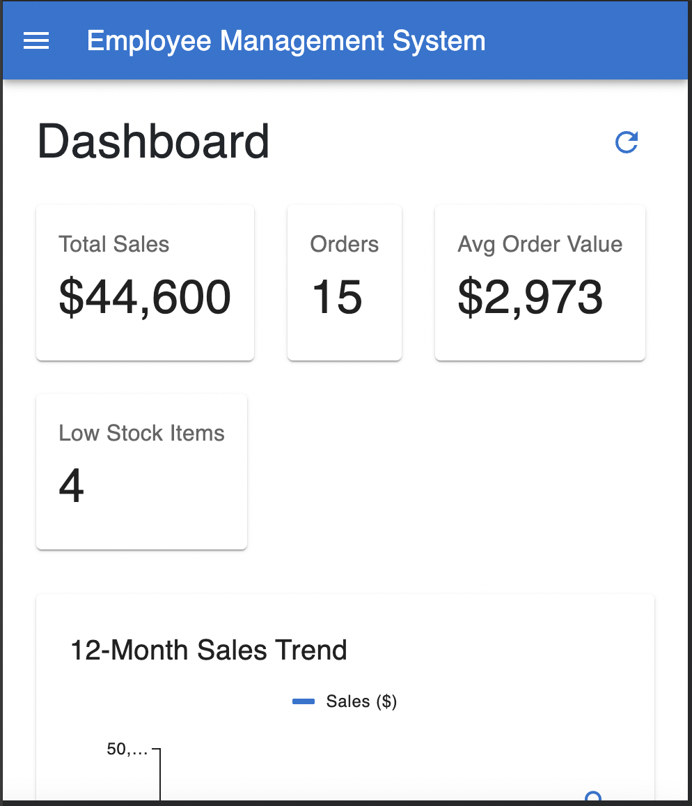

# ERP React – Inventory & Order Management System

A full-featured inventory, order, and workforce management dashboard built with **React 19**, **Vite**, **MaterialUI**, and **TanStack Query**.

 <!-- Replace with a real screenshot -->

## Table of Contents

1. [Overview](#overview)
2. [Features](#features)
3. [Tech Stack](#tech-stack)
4. [Architecture & Data Flow](#architecture--data-flow)
5. [Getting Started](#getting-started)
6. [Mock Data & APIs](#mock-data--apis)
7. [Deployment (Netlify)](#deployment-netlify)
8. [Project Structure](#project-structure)
9. [Roadmap](#roadmap)
10. [Contact](#contact)

---

## Overview

This project is an **ERP System** for a small music company. It showcases:

- Dashboard metrics that stay in sync with inventory and order changes via React Query cache invalidation.
- CRUD flows for inventory, orders, and employees backed by MSW (Mock Service Worker).
- Material UI DataGrids with search, filtering, pagination, detail drawers, and dialogs.
- Modular components (e.g., `InventoryInstrumentsGrid`, `OrderFormDialog`) that reflect production-ready patterns.
- TypeScript-first development, including reusable types and hooks.

Use this repository to demonstrate modern frontend engineering practices, rapid prototyping with mock data, and readiness for real-world React ecosystems.

---

## Features

- **Dashboard Insights**
  - Live KPIs for total revenue, order pipeline, low-stock alerts, and instrument utilization.
  - Charts powered by `@mui/x-charts`.

- **Inventory Management**
  - Instruments table with search, pagination, and inline actions.
  - “Stock-in” transactions feed stored in `StockTransactionsGrid`.
  - Add/Edit dialog extracted into `InstrumentFormDialog`.

- **Orders Workflow**
  - Orders DataGrid with status badges, amount formatting, and detail drawer.
  - Order creation/editing via `OrderFormDialog` with dynamic line items.
  - Status updates propagate to dashboard metrics.

- **Employee Directory**
  - List, edit, and delete employees with confirmation dialogs.
  - Form pre-population driven by MSW GET/PUT handlers.

- **React Query Integrations**
  - Centralized hooks in `src/hooks/useData.ts`.
  - Automatic cache refetching after mutations (inventory, orders, dashboard).

- **Global Mock API**
  - MSW handlers for employees, instruments, stock transactions, and orders.
  - Production-safe mocking toggle via `VITE_ENABLE_MSW`.

---

## Tech Stack

| Category    | Tools                                                 |
| ----------- | ----------------------------------------------------- |
| Framework   | React 19, React Router 7                              |
| Build Tool  | Vite 6 (TypeScript)                                   |
| UI Library  | Material UI v7, MUI X DataGrid, MUI X Charts, Emotion |
| State/Data  | TanStack React Query 5                                |
| Mocking     | MSW 2                                                 |
| HTTP Client | Axios                                                 |
| Styling     | MUI System, Bootstrap                                 |
| Deployment  | Netlify                                               |

---

## Architecture & Data Flow

```
┌──────────┐      ┌──────────────┐      ┌──────────────┐
│ React UI │ ───▶ │ React Query  │ ───▶ │ MSW Handlers │
└──────────┘      └──────────────┘      └──────────────┘
       ▲                 │                      │
       └──────Mutations / Cache Invalidation────┘
```

- UI components call hooks from `src/hooks/useData.ts`.
- Hooks delegate to Axios services hitting MSW endpoints (`/api/*`).
- MSW mutates in-memory data and recalculates dashboard stats, keeping the experience consistent without a real backend.

---

## Getting Started

### Prerequisites

- Node.js **20.x** (aligns with Netlify build image)
- npm 10+

### Installation

```bash
git clone https://github.com/<your-username>/ems-react.git
cd ems-react
npm install
```

### Development

```bash
npm run dev
```

The dev server runs at [http://localhost:5173](http://localhost:5173) with MSW auto-started.

### Linting & Formatting

```bash
npm run lint
```

### Production Build

```bash
npm run build
npm run preview   # optional sanity check
```

The output lives in `dist/`.

---

## Mock Data & APIs

- MSW worker file: `public/mockServiceWorker.js`
- Handlers: `src/mocks/handlers.ts`
- Worker bootstrap: `src/main.tsx`
- Toggle mock API at runtime with **VITE_ENABLE_MSW**:
  - Default is `"true"` (enabled for both dev & prod).
  - Set `VITE_ENABLE_MSW=false` in `.env` or Netlify environment variables if you later connect a real backend.

Updating mock data is as simple as editing `src/data/*.json` or handlers.

---

## Deployment (Netlify)

1. **Build command**: `npm run build`
2. **Publish directory**: `dist`
3. **Environment variables** (optional but recommended):
   - `NODE_VERSION=20`
   - `VITE_ENABLE_MSW=true` (only needed if you override the default)
4. **SPA Redirects**: already handled via `public/_redirects`

After deployment, every route (e.g., `/orders`, `/employees/:id/edit`) can be refreshed without 404s, and mock APIs remain active.

---

## Project Structure

```
├── public/
│   ├── _redirects
│   └── mockServiceWorker.js
├── src/
│   ├── components/
│   │   ├── InventoryInstrumentsGrid.tsx
│   │   ├── InstrumentFormDialog.tsx
│   │   ├── OrderDetailDrawer.tsx
│   │   └── OrdersGrid.tsx
│   ├── hooks/
│   │   └── useData.ts
│   ├── mocks/
│   │   ├── browser.ts
│   │   └── handlers.ts
│   ├── pages/
│   │   ├── Dashboard.tsx
│   │   ├── Inventory.tsx
│   │   └── Orders.tsx
│   ├── components/
│   │   └── EmployeeForm.tsx
│   └── main.tsx
├── package.json
├── tsconfig.json
└── vite.config.ts
```

---

## Roadmap

- [ ] Connect to a real backend (Express/FastAPI) while keeping MSW for local development.
- [ ] Add authentication (Auth0 or Cognito) to secure employee management.
- [ ] Create advanced analytics: cohort retention, revenue forecasting, anomaly detection.
- [ ] Introduce unit & e2e tests (Vitest + Testing Library + Playwright).
- [ ] CI/CD pipeline (GitHub Actions) for lint, test, and Netlify preview deploys.

---

## Contact

If you’re evaluating me for frontend roles or have feedback:

- **Name**: _[Your Name]_
- **Email**: _[your.email@example.com]_
- **LinkedIn**: _[linkedin.com/in/your-profile]_

Feel free to open issues or feature requests—this project is actively evolving as part of my learning and interview preparation.

---

**Enjoy exploring EMS React!** If this repo helps you evaluate my skills, please ⭐️ star it and reach out. Thanks! 🙌
